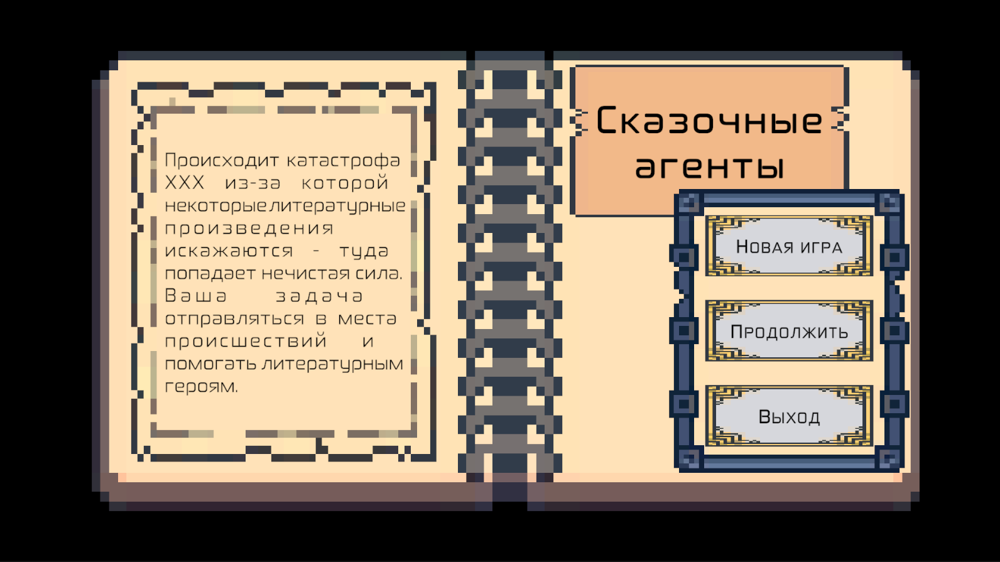
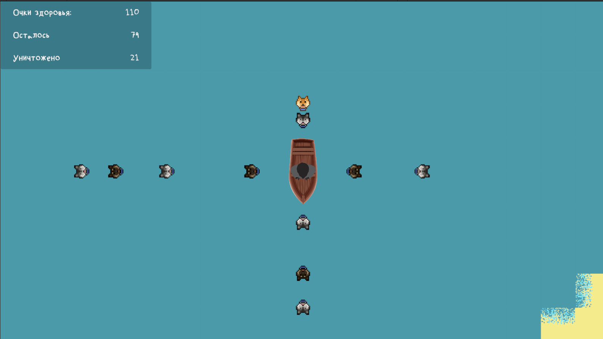
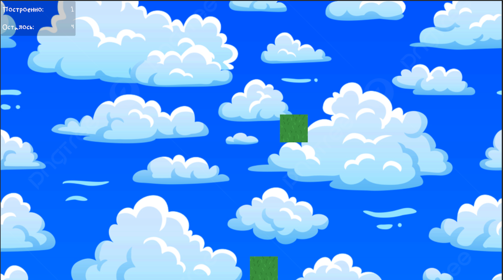
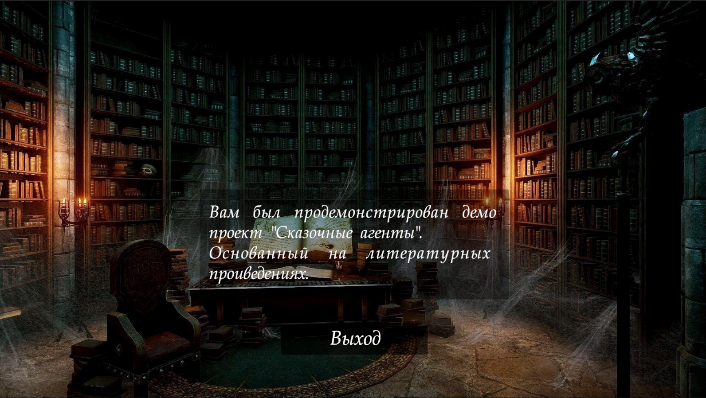

# Fairytale Agency

Eng | [Rus](resources/localization_readme/readme_ru.md)

This is a desktop game being developed as part of the GameDev Hackathon by TVP.

## Description

In a world where literary works become reality, a catastrophe has occurred caused by a malevolent force. This force distorts reality, turning book characters into beings living in our world. The catastrophe has led to many literary works becoming unpredictable and dangerous.

Your hero is a special agent sent by an organization dedicated to protecting literary works. He possesses unique abilities that allow him to interact with distorted realities and restore order.

Your task is to explore each zone, interact with literary characters to help them restore order and return them to their realities. In the process, you will encounter various obstacles and enemies created by the malevolent force.

## The Game is Available

The game is available for download from the [GitHub release](https://github.com/ShutovKS/Fairytale-agents/releases), and there is also the option to play the web version on the platform [Itch](https://shutovks.itch.io/fairytale-agents).

## License

``` text
MIT License
```

## Screenshots









