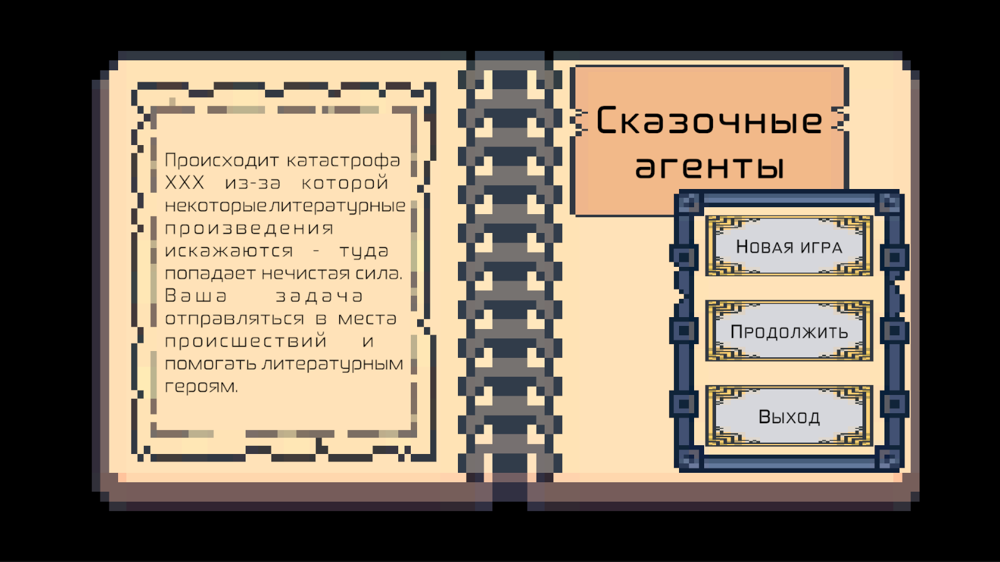
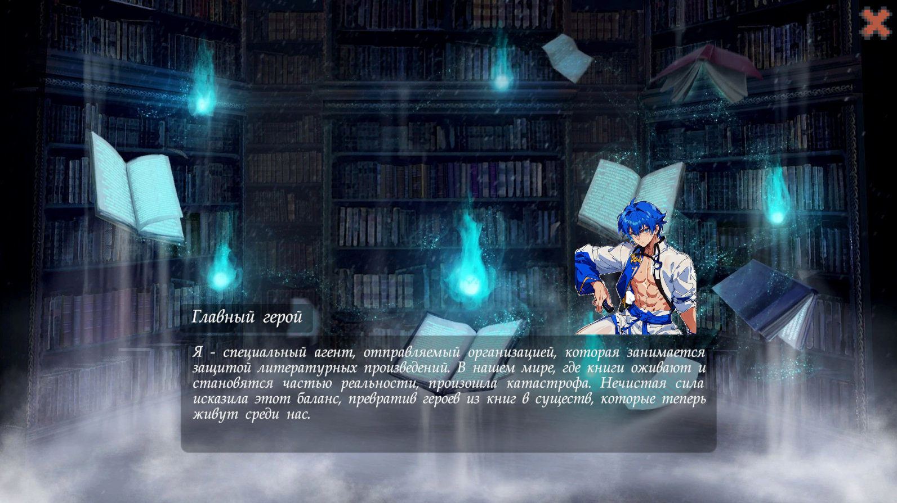
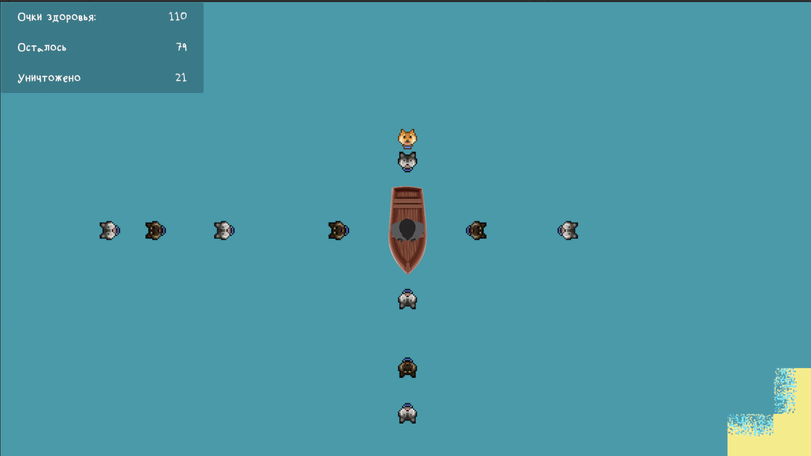
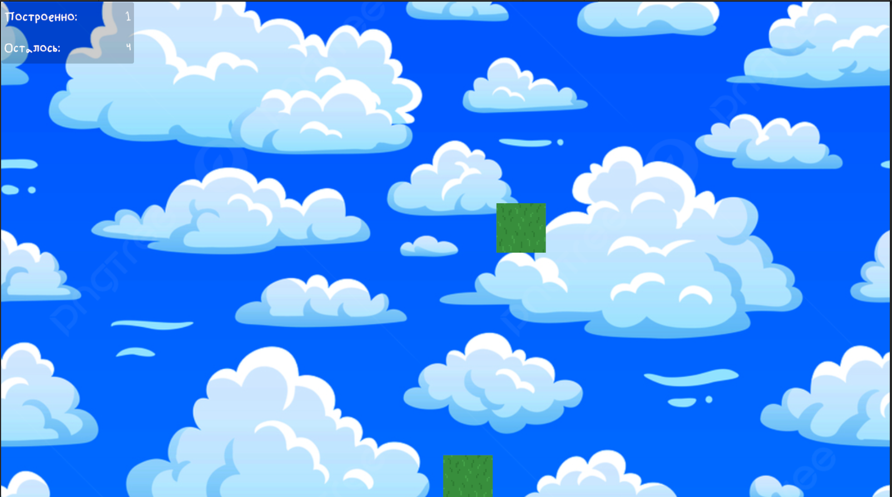
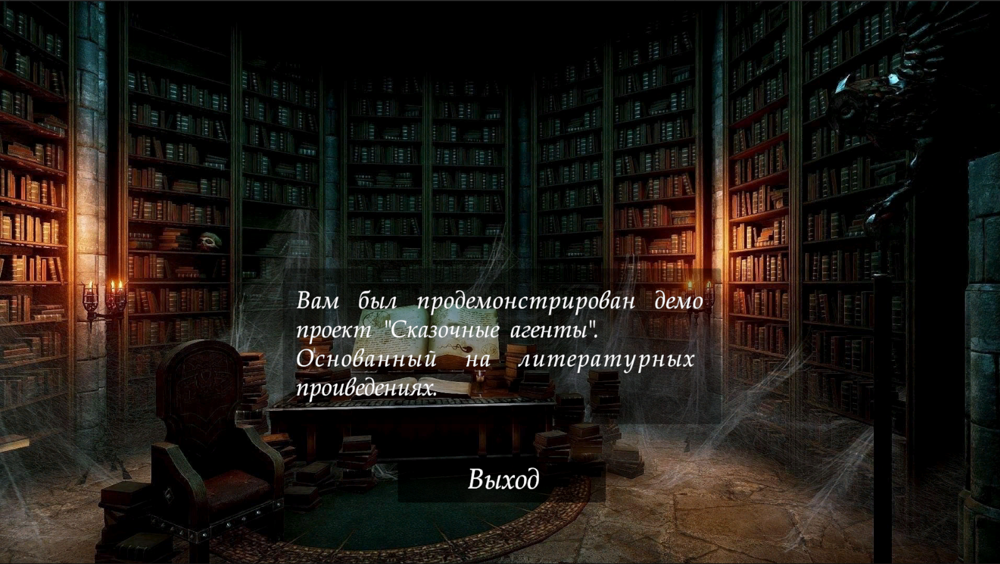

# Сказочное агентство

Rus | [Eng](../../README.md)

Это игра для десктопных платформ разрабатываемая в рамках GameDev Хакатоны ТВП.

## Описание

В мире, где литературные произведения становятся реальностью, произошла катастрофа, вызванная нечистой силой. Эта сила искажает реальность, превращая героев из книг в существ, живущих в нашем мире. Катастрофа привела к тому, что многие литературные произведения стали непредсказуемыми и опасными.

Ваш герой - это специальный агент, отправленный организацией, занимающейся защитой литературных произведений. Он обладает уникальными способностями, позволяющими ему взаимодействовать с искаженными реальностями и восстанавливать порядок.

Ваша задача - исследовать каждую зону, взаимодействовать с литературными героями, чтобы помочь им восстановить порядок и вернуть их в свои реальности. В процессе вы будете сталкиваться с различными препятствиями и врагами, созданными нечистой силой.

## Игра доступна

Игра доступна для скачивания с [GitHub release](https://github.com/ShutovKS/Fairytale-agents/releases), так же есть возможность поиграть в веб версию на платформе [Itch](https://shutovks.itch.io/fairytale-agents).

## Лицензия

``` text
MIT License
```

## Снимки экрана










